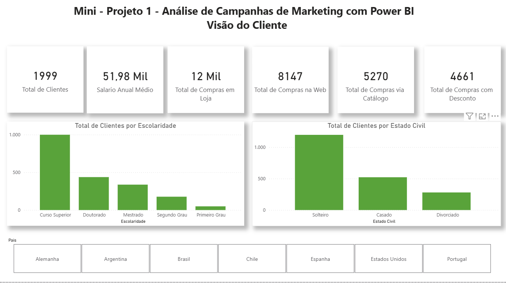
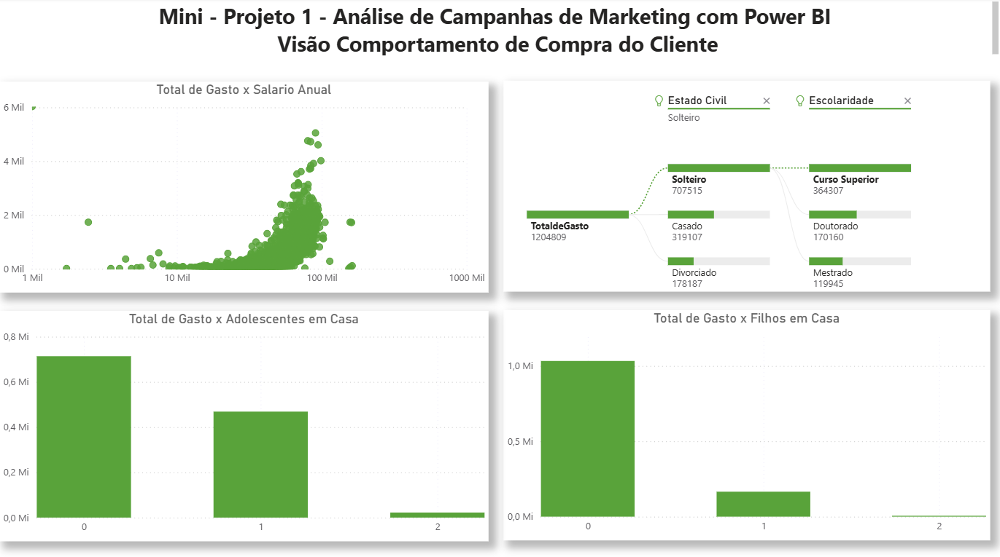
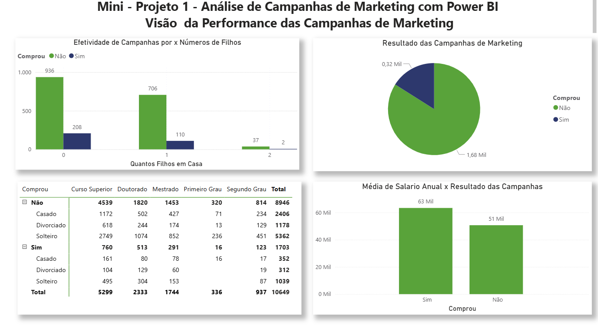
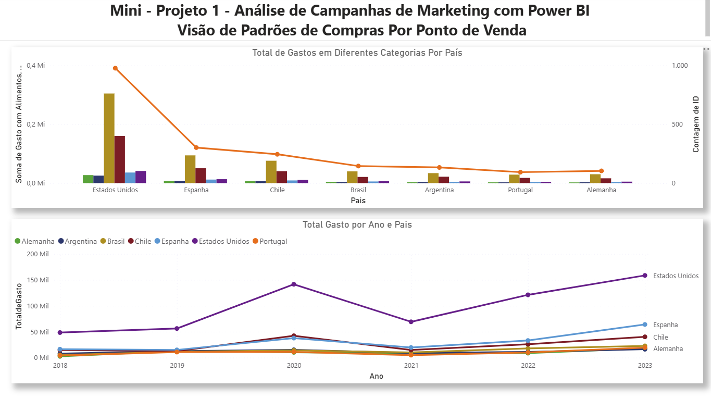

# 📊 Análise de Campanhas de Marketing com Power BI: Desvendando a Jornada do Cliente

Oi! Que bom que você chegou até aqui. Este projeto é um pedacinho do meu portfólio onde mostro como transformo dados brutos em histórias e insights valiosos para o mundo dos negócios. Meu foco aqui foi entender a jornada do cliente e a real eficácia das campanhas de marketing, tudo isso com a ajuda do Power BI.

Como estudante de **Análise e Desenvolvimento de Sistemas (ADS)** e **Data Science**, cada linha de código e cada visualização foram pensadas para aplicar o que aprendo sobre modelagem de dados e visualização de um jeito prático e impactante.

## 🧠 A Estrutura da Nossa Conversa (e dos Dados!)

Organizei este dashboard como uma boa conversa, onde cada parte nos leva a uma nova descoberta, facilitando a tomada de decisões estratégicas. Vamos lá?

### 1. Quem são Nossos Clientes? (O Perfil da Galera!)

Começamos entendendo quem está do outro lado. Analisei uma base de 1.999 clientes para saber direitinho com quem estamos falando e como podemos nos conectar melhor.

*   **Números que Contam Histórias**: A média salarial anual da nossa base é de 51,98 mil, e o volume total de clientes nos dá uma boa dimensão do nosso público.

*   **Um Olhar na Diversidade**: Descobrimos que a maioria tem **Curso Superior** e é **Solteiro**, o que já nos dá pistas importantes.

*   **De Onde Eles Vêm?**: Nossos clientes estão espalhados por lugares como Brasil, Alemanha, Espanha e Estados Unidos. É um mundo de possibilidades!

### 2. Como Eles Compram? (A Jornada de Compra!)

Depois de conhecer a galera, a gente quer saber: como eles interagem com a marca? Onde eles preferem comprar?

*   **Hábitos que Revelam**: Cruzei dados de escolaridade com a propensão a comprar, para entender o que motiva cada grupo.

*   **Onde a Mágica Acontece**: Comparei as compras feitas pela **Web**, na **Loja Física** e via **Catálogo**, para ver qual canal brilha mais.

### 3. Nossas Campanhas Estão Arrasando? (A Performance!)

Chegou a hora da verdade! Nossas campanhas estão convertendo? O que está funcionando e o que podemos melhorar?

*   **Detalhes que Fazem a Diferença**: As visualizações mostram os resultados em números absolutos e porcentagens, para uma análise rápida e certeira do nosso retorno sobre investimento (ROI).

*   **O Segredo do Sucesso**: Mapeei quais segmentos de clientes foram mais receptivos, gerando os maiores índices de conversão. Assim, a gente sabe onde focar!

### 4. Desvendando Padrões de Vendas (A Matriz Mágica!)

Para ir ainda mais fundo, criei uma matriz que nos permite explorar os dados em detalhes, como se estivéssemos desvendando um mistério!

*   **Decisões com Dados**: Detalhei as compras por estado civil, dentro de cada categoria (Comprou 0 ou 1), para entender as nuances de cada grupo.

*   **Interatividade na Ponta dos Dedos**: Com ícones de adição/subtração, você pode mergulhar nos dados e ver cada detalhe que importa.

---

## 🛠️ Minhas Ferramentas e Habilidades em Ação

Neste projeto, coloquei em prática:

*   **Modelagem de Dados**: Estruturei tabelas e criei relacionamentos complexos para que os dados fizessem sentido.

*   **Visualização Avançada**: Configurei ícones e rótulos personalizados para que a experiência de quem usa o dashboard seja a melhor possível.

*   **Visão de Negócio (CX)**: Apliquei métricas que realmente importam para o sucesso do cliente e para o aumento das vendas.

---

## 👤 Um Pouco Sobre Mim: Victoria Cerqueira Viana

Sou a Victoria, e estou em uma jornada super empolgante para a área de dados! Trago comigo mais de quatro anos de experiência em **Customer Success (CS)** e **Customer Experience (CX)**, o que me dá uma visão única sobre as pessoas e suas necessidades. Agora, estou unindo essa paixão por gente com minhas novas habilidades em **Python, SQL e Power BI**, pronta para criar soluções que realmente fazem a diferença!
